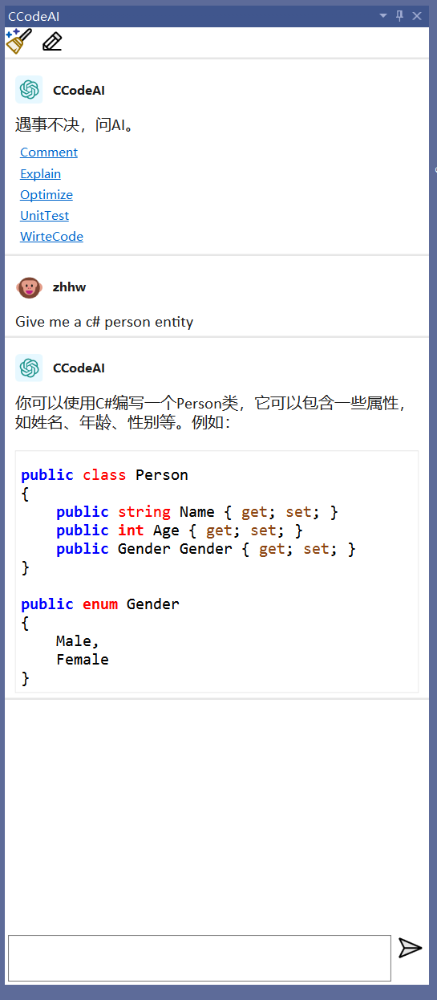
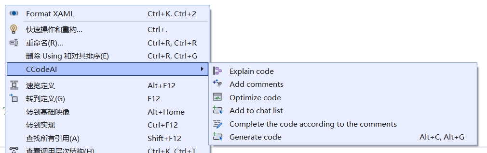

# CCodeAI

**Build AI Epxerience in Visual Studio**

A Visual Studio extension that, like GitHub Copilot, enables you to chat with OpenAI and generate code.
Get started with **CCodeAI** is easy, just install the extension in visual studio marketplace, and then you can chat with OpenAI in the Visual Studio.

## Use the ability of ChatGPT to assist in coding

Download：[Visual Studio Marketplace](https://marketplace.visualstudio.com/items?itemName=TimChen44.CCodeAI)

## Features

* Chat
* Explain the code
* Comment the code
* Optimize the code
* Continue writing code according to the comments
* Ask for clarification about the code

## Chat in Visual Studio

[Tools] -> [CCodeAI] -> Chat with OpenAI

## Generate code

You can use the CodeGen window to generate code, which includes some preset prompts to help you generate different types of code. 

## Quick Chat

Of course, you can also quickly start a conversation with AI by selecting the code directly in the editor.

## Context Menu

You can also access CCodeAI's features by right-clicking in the editor.

## CodeFixes - Under development

## TODO

- [ ] Generating commit messages and generating pull request feedback.
- [ ] More codefixes.
- [ ] Use codex model to generatecode.
- [ ] Code Completion whick like github copilot.
- [ ] Provide annotation translation

# Update Log

[ChangLog](./ChangLog.md)
